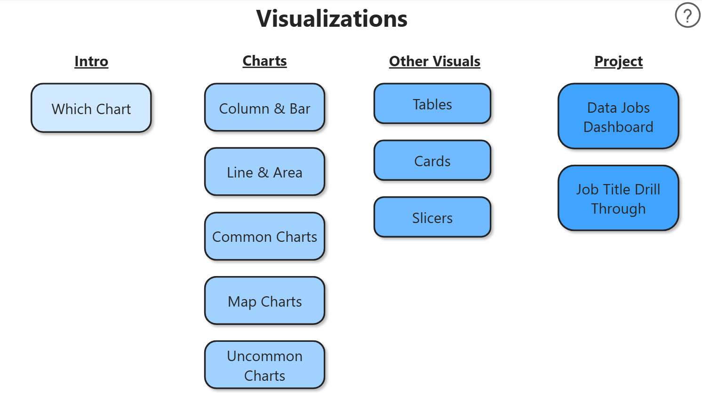

# Different Visualizations using Power BI

## Introduction

This dashboard was created using public data by Luke Barousse about the jobs around data science of year 2024 and includes around 400k jobs. Using a real-world dataset this includes a dashboard which can be used by **Job Seekers, Job Transitioners or anyone who wants to work here**. 

## Skills Showcased

- **⚙️ Data Transformation (ETL) with Power Query**: Cleaned, shaped, and prepared the raw data for analysis by handling blanks, changing data types, and creating new columns.
- **🧮 Implicit Measures**: Formulated measures to derive key insights and KPIs like Median Yearly Salary and Job Count.
- **📊 Core Charts**: Utilized Column, Bar, Line, and Area Charts to compare job counts and track trends over time.
- **🗺️ Geospatial Analysis**: Leveraged Map Charts to visualize the global distribution of jobs.
- **🔢 KPI Indicators & Tables**: Used Cards to display key metrics and Tables to provide granular, sortable data.
- **🎨 Dashboard Design**: Designed an intuitive and visually appealing layout, exploring both common and uncommon chart types to best tell the data story.
- **🖱️ Interactive Reporting**:
    - **Slicers**: To dynamically filter the report by Job Title.
    - **Buttons & Bookmarks**: To create a seamless navigation experience.
    - **Drill-Through**: To navigate from a high-level summary to a contextual, detailed view.

### Home Page

This page is used for navigation and by clicking CTRL and choosing any of those pages, you can visit the page.

### Project: Data Jobs Dashboard 

This is your mission control for the data job market. It showcases key KPIs like total job count, median salaries, and top job titles to give you a quick understanding of what's happening in the job market at a glance.

### Project: Job  Title Drill Through

This is the deep-dive page. From the main dashboard, you can drill through to this view to get specific details for a single job title, including salary ranges, work-from-home stats, top hiring platforms, and a global map of job locations.

## Conclusion

This dashboard showcases how Power BI can transform raw job posting data into a powerful tool for career analysis. It allows users to slice, filter, and drill through data to make informed decisions about their career paths.

