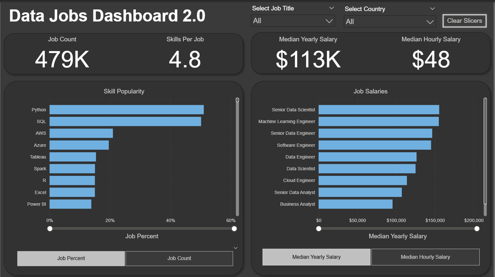

# Data Jobs Dashboard 2.0 w/ Power BI

## Introduction

The data job market can be overwhelming, with information often scattered and hard to navigate. This dashboard (V2.0) is built for **Job Seekers, Job Transitioners, and Job Swappers**, providing a clear and focused view. Leveraging a comprehensive 2024 dataset of data science job postings—including roles, salaries, and locations—the project delivers a single-page solution for quickly uncovering key market trends and salary insights.

### Dashboard File
You can find the file for the dashboard here: [`Data_Jobs_Dashboard_2.0.pbix`](Data_Jobs_Dashboard_2.0.pbix).  

## Skills Showcased
This project highlights key Power BI skills and features:

* 🎨 **Dashboard Design:** Crafted an intuitive and visually appealing report layout.
* 🧹 **Power Query ETL:** Performed data cleaning, transformation, and shaping.
* 🗂️ **Data Modeling:** Built efficient relationships and applied Star Schema principles.
* 🧮 **DAX Fundamentals:** Used calculations and aggregations to uncover insights.
* 📊 **Visualizations:**
  * 📈 **Core Charts:** Column, bar, line, and area charts for analysis and trends.
  * 🗺️ **Map Charts:** Displayed geospatial data.
  * 🃏 **Cards:** Showcased key metrics.
  * 📋 **Tables:** Presented detailed data.
  * 🧩 **Chart Variety:** Selected diverse chart types for clear storytelling.
* 🖱️ **Interactive Elements:**
  * 🟦 **Slicers:** Enabled dynamic filtering.
  * 🔘 **Buttons & Bookmarks:** Supported navigation and drill-through views.
---

## Dashboard Overview (Version 2.0 - Single Page Focus)
This updated version streamlines everything into one clear, interactive page, making it easy for job seekers to access essential market insights instantly.

 
This dashboard serves as a streamlined hub for navigating the data job market. It highlights essential KPIs such as **Job Count, Skills Per Job, Median Yearly Salary, and Median Hourly Salary**. Users can easily explore **Skill Popularity** (by percentage or count) and compare **Salaries by Job Title**, providing a fast and effective summary of market trends.

---

## Conclusion

This enhanced dashboard (Version 2.0) demonstrates how Power BI can convert large volumes of job posting data into a concise, actionable resource for career planning. It enables **Job Seekers, Job Transitioners, and Job Swappers** to quickly filter and analyze key market information on one page, supporting smarter career choices.

